# AI 事件处置助手 — 用户需求说明

> **项目链接：** `ali-github.sysu.edu.cn/huoban/HASE-Cloud-Coc/IncidentManagement`
> **文档用途：** 本文件特用于用户侧的业务需求，详细定义了系统核心用例图、核心用例边界，并提供了 7 个 Jenkins 故障典型事件（IN9451263）进行端到端的日常使用场景故事，作为系统建设的业务诉求。

---

## 一、实现要求 (Implementation Readiness 6hrs)

在用例编写阶段，每个阶段必须达到完成度标准，确保仅开发的图是不具功能图，且图是可实现、可验证、可回滚的业务规则：

- **阶段 1：监控与发现：** 明确失败事件定义、列举字段、排序规则、可选筛选、无时间戳 UTC 约束、历史事件检索入口与边界范围。事件经理和工程师能快速看到当前 active 事件，按本地时间降序。
- **阶段 2：编排与响应：** 明确编排触发文本输入框、数据、默认 P1 优先级、AI 提示词、AI 推荐定级、人工修正点、SLA 固定规则、Cosy 初始同步与回调判定。事件创建后能看到默认 P3、AI 推荐、P1 等属性。
- **阶段 3：任务处理与跟踪：** 明确任务编辑框、模板填充、AI 解约总结、Jira 同步、Task SLA 预警、动态摘要合并、RAG 四块历史回闪片。事件管理可确认是否关闭 AI 推荐行动项，工程可修改任务、失败原因、回闪、链接、关联的推荐。
- **阶段 4：复盘与闭环：** 明确 resolved 解决条件、SRE Notebook 字段、Confluence 目录、三要素切分、向量化降级、后缘 RAG 可回岁月。事件经理发布站内长复盘，系统能把复盘的沉淀转化为可检索的知识。

> **说明：** 每个阶段图的实现细节在进入开发前，都必须涵盖：触发角色、输入字段、状态变化、人工介入点、异常/重试策略、数据库落盘位置、外部系统影响和校验标准。

---

## 二、用户需求用例说明 (Use Case Diagram)

本系统采用分阶段的方式细化用例的设计，下面首先给出 **全局用例总览图**，随后对四大生命周期阶段进行 **子系统用例细化与规范补充**，以便于全方位指导后续的功能规范实现和代码开发。

### 2.1 全局用例图 (Global Use Case Overview)

全局图给出了整体功能边界，以及事件经理和处理工程师在四大生命周期、第三方同步以及复盘用例中的权限与关联关系：

```mermaid
flowchart TD
    subgraph System_Boundary ["AI 事件管理系统边界 (System Boundary)"]
        UC_Dashboard(["UC-01: 实时仪表盘监控看板"])
        UC_Orchestrate(["UC-02: 一键智能响应编排"])
        UC_Severity(["UC-03: 事件故障等级推导与人工修正"])
        UC_Task(["UC-04: AI 推荐行动项提取与 Task SLA 分配"])
        UC_Update(["UC-05: 动态报告摘要合并更新"])
        UC_Recommend(["UC-06: RAG 一步行动步骤推荐"])
        UC_PostMortem(["UC-07: 一键 SRE 复盘与知识沉淀"])
        UC_Search(["UC-13: 历史故障多维筛选与模糊检索"])

        UC_Embed(["UC-08: 文本向量 (embedding) 生成"])
        UC_Summary(["UC-09: AI 报告两步式结构化摘要"])
        UC_Cosy(["UC-10: 第三方 cosy 系统异步数据对齐"])
        UC_Confluence(["UC-11: Confluence AI 日报自动发布"])
        UC_RAG_Sim(["UC-12: SRE 三要素切片 pgvector 扫描"])
    end

    %% 系统参与者 (Actors)
    Manager(["事件经理 (Incident Manager: brien)"])
    Engineer(["处理工程师 (SRE Engineer: brien)"])

    %% 用例关联关系 (Use Case Associations)
    Manager --> UC_Dashboard
    Manager --> UC_Orchestrate
    Manager --> UC_Severity
    Manager --> UC_Task
    Manager --> UC_PostMortem
    Manager --> UC_Search

    Engineer --> UC_Dashboard
    Engineer --> UC_Orchestrate
    Engineer --> UC_Update
    Engineer --> UC_Recommend
    Engineer --> UC_Search

    %% 包含依赖关系 (Include Relationships)
    UC_Orchestrate --> UC_Embed
    UC_Orchestrate --> UC_Summary
    UC_Orchestrate --> UC_Severity
    UC_Orchestrate --> UC_Cosy
```

### 2.2 监控与发现用例图 (Monitoring & Discovery Phase)

本阶段用例专注于实时态势感知与检索，摒弃传统的"刷到页"高压监控设计，通过清爽、状态高亮的看板辅助事件经理与处理工程师感知当前故障全局情况。

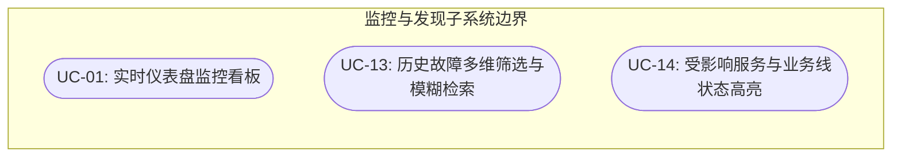

#### 用例细化规范

##### UC-01：实时仪表盘监控看板

| 项目 | 内容 |
|------|------|
| 主参与者 | 事件经理 (IM)、处理工程师 (SRE) |
| 前置条件 | 用户已成功登录系统并具备阅读与读取权限 |

**主事件流：**

1. 用户进入系统首页。
2. 系统以列表形式呈现当前处于 active 状态的故障。
3. 系统自动在后台计算各事件已持续时间：Now(t) - 发生时间，并作为列表关键指标呈现。

> **约束：** 系统严禁显示任何形式的"事件故障截止时间倒计时"，规避高压视觉干扰。

##### UC-13：历史故障多维筛选与模糊检索

| 项目 | 内容 |
|------|------|
| 主参与者 | 事件经理 (IM)、处理工程师 (SRE) |
| 前置条件 | 用户处于仪表盘或检索页面 |

**主事件流：**

1. 用户输入 Ticket ID (如 IN9451263) 或标题关键字。
2. 用户勾选受影响业务线或受影响的服务名。
3. 系统执行适配期业务模糊与 Vector 召回，将匹配的结果呈现在当前列表中。

### 2.3 智能编排与定级用例图 (Orchestration & Severity Phase)

本阶段以默认 P3 作为初始故障故障等级基线，实现自然语言口述文本到 SRE 结构化学的秒级转化，并先由系统给出 AI 推荐等级，再由事件经理根据实际影响进行人工修正或确认，最后与外部 Cosy 系统完成异步高效对齐。

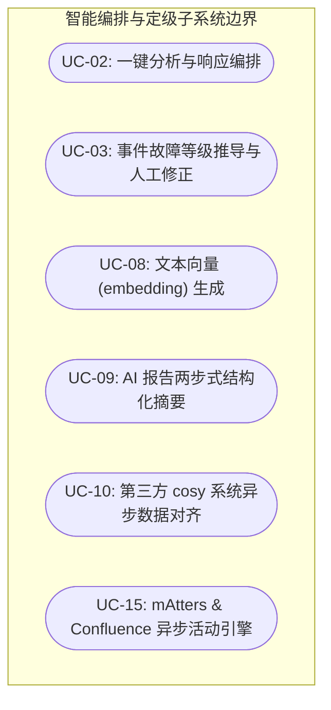

#### 用例细化规范

##### UC-02：一键分析与响应编排

| 项目 | 内容 |
|------|------|
| 主参与者 | 处理工程师 (SRE)、事件经理 (IM) |
| 前置条件 | 用户已打开具体事件的编排文本域 |

**主事件流：**

1. 用户将包含告警及即时通讯记录的无结构文本粘贴至文本框中，点击"一键编排"。
2. 系统触发多路并发 UC-09 两步式 AI 摘要，生成极高精准度的 SRE 报告大纲与高置信事实总结。
3. 系统并发触发 UC-08 文本向量 embedding 生成，并在 pgvector 中通过余弦相似度匹配出 top-3 相关历史故障。
4. 系统并发触发 UC-15 外部系统导航：根据服务名自动拉取 mAtters 值班人员和 Confluence SRE 操作手册链接。
5. 系统存储基础事件信息并自动调用 UC-10 发送第三方 Cosy 初始化推送。

> **后置条件：** 编排状态流转为 pending/synced，页面成功刷新呈现丰富的结构化卡片与候选推荐决策卡。

##### UC-03：事件故障等级推导与人工修正

| 项目 | 内容 |
|------|------|
| 主参与者 | 事件经理 (IM) |
| 前置条件 | 事件已创建但 P3 为初始故障等级，编排推导定级与理由已在前端表单呈现 |

**主事件流：**

1. 事件经理查看默认 P3 初始等级与 AI 定级推荐。
2. 根据定级参考，如果实际影响和内部服务等级需要升级，允许通过 Impact / Urgency 下拉框手动更改并手动输入理由。
3. 点击"确认并保存"，系统更新事件等级、锁定当前值，并自动关联系统内部的 Task SLA 时限。
4. 系统发起 UC-10 Cosy 异步同步，更新变更信息至 Cosy。

> **后置条件：** 事件故障等级确定成功，SLA 计时的计算已发起。

### 2.4 任务与决策推荐用例图 (Handling & Tracking Phase)

本阶段用例专注于事件处理过程中的任务职能抽取、SLA 实时期期守护以及向量数据库的高精确度推荐建议召回，最终缩短平均故障恢复时间（MTTR）。

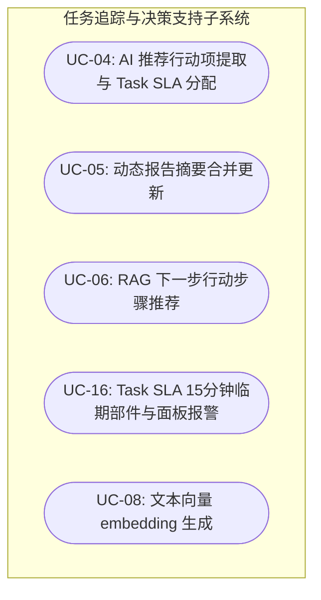

#### 用例细化规范

##### UC-04：AI 推荐行动项提取与 Task SLA 分配

| 项目 | 内容 |
|------|------|
| 主参与者 | 事件经理 (IM) |
| 前置条件 | 会议现有新会议纪要或非结构化处理描述文本 |

**主事件流：**

1. 事件经理/处理工程师粘贴文本，点击"提取任务"。
2. 后台大模型充当 AI PM，提取出具体性质任务、建议负责人及假定截止时间的 Task 实体。
3. 任务一键生成并保存至 PostgreSQL Tasks 表中。
4. UC-16 期期守护 mAtters，每分钟实时扫描本组内任务，发现截止时间不足 15 分钟时，自动触发报警部件，并在前端页面爆出黄色闪动项，防止 Task SLA 超期。

> **后置条件：** 行动分支成功，后台 SLA 监控定时守护程序开始工作。

##### UC-06：RAG 下一步行动步骤推荐

| 项目 | 内容 |
|------|------|
| 主参与者 | 处理工程师 (SRE) |
| 前置条件 | 处理人员可在查询检核框中输入了当前排障的技术瓶颈或错误描述 |

**主事件流：**

1. 工程输入 Query。
2. 系统调用 UC-08 Embedding 接口，进行向量化。
3. 通过余弦算法检索 runbook_steps 和 post_mortem_chunks，并返回带注释说明的 Top-3 建议步骤。

> **后置条件：** 排障步骤清晰列出，点击可直接跳转。

### 2.5 智能复盘与归档闭环用例图 (Post-Mortem & Closure Phase)

本阶段用例专注于事件解决后的无缝复盘文档自动化生成、自动挂载企业 Confluence，以及切分落库实现 RAG 的自演进与知识沉淀。

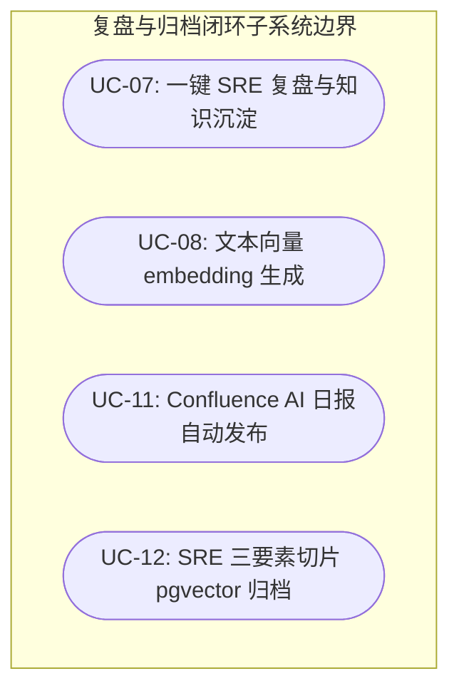

#### 用例细化规范

##### UC-07：一键 SRE 复盘与知识沉淀

| 项目 | 内容 |
|------|------|
| 主参与者 | 事件经理 (IM) |
| 前置条件 | 当前事件已成功转为 resolved 状态，一键复盘按钮解锁 |

**主事件流：**

1. 事件经理点击"一键复盘"。
2. 大模型聚合收集 70+ 个属性、历史任务列表、及动态进展 Timeline，秒级生成一份排版精美的 Markdown 复盘报告初稿。
3. 事件经理点击发起复盘。
4. 系统自动 UC-11 Confluence 挂载发布：将报告渲染为 XHTML，精确投递挂载在 Confluence 指定目录树下。
5. 系统自动 UC-12 RAG 切片归档：自动提取现象、原因、对策三要素并转存 UC-08 向量化，批量持久化写入 post_mortem_chunks 表中。

> **后置条件：** Confluence 文档生成并发布完成，RAG 向量库追加注入，系统完成知识的回调自我进化。

---

## 三、典型使用场景故事 (IN9451263 场景演进)

基于系统核心功能的闭环行走，通过以下典型场景展现事件经理 Leon 与工程师 Pak Ming HUI 在 Jenkins Master 8 断流生产事件 (IN9451263) 中的无缝工作流：

### 场景一：仪表盘全息态势感知（第 1 阶段 — Discovery & Monitoring）

**业务流程：**

事件经理 Leon 登录实时仪表盘，快速浏览列表，活动表格中呈现了当前的进行中事件。事件故障虽标注 P2，事件状态较高亮状态，在前端页面摒弃了传统的"事件故障倒计时"高压提示，界面干净，聚焦在当前活动状态及起止时间。事件经理点击进入 IN9451263 详情页，开始主导响应。

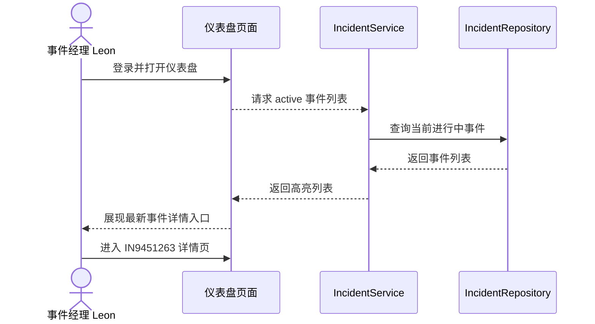

### 场景二：一键智能响应编排（第 2 阶段 — Initial Analysis & Response）

**业务流程：**

GLOBAL MCP JENKINS-UK 监控突发网络超时报警，大量 HASE 团队的任务由于网络原因中断，一线处理工程师 Pak Ming HUI 接警。他将本次告警信息及即时通讯记录的杂乱文本复制粘贴到详情页的编排文本框中，点击"一键编排"。

系统随后在 4 秒内完成三路并发：

1. **两步式 AI 摘要：** 提炼出核心大景：Jenkins Master 8 正在发生迁移，新服务器 IP 被安全网络隔离，导致连接 GOS/SHP 通断故障。
2. **语义大模型推断：** 从历史故障中，秒级匹配到类似的历史防火墙过期策略，指出其可能由于安全流程未能效。
3. **外部系统导航：** mAtters 自动拉取当前 SRE 值班人 Pak Ming HUI。自动从 CMDB 获取该应用绑定的安全负责人联系方式，以在生成报告后决定智能的秒级联系人 ITSO 安全合规时，并一键拉取了 IT 子集指南自动操作手册。

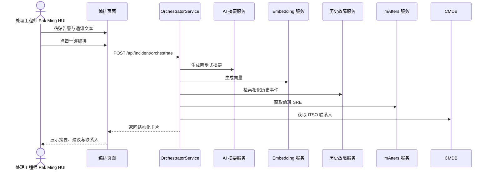

### 场景三：基于优先级矩阵的智能定级与人工干预（第 2 阶段）

**业务流程：**

系统全面对接了全新 Incident 优先级矩阵 (Priority Matrix)。系统基于事件来源渠道，执行以下智能化定级流程：

1. **自动评估影响面 (Impact)：** 系统 AI 自动按服务数据及条件，自动映射为 Critical、High、Medium、Low 四个 Impact 级别。
2. **自动评估紧急度 (Urgency)：** 系统 AI 分类根据系统安全、品牌、财务损失程度，自动映射为 Critical、High、Medium、Low 四个 Urgency 级别。
3. **只读优先级计算 (Priority)：** 系统严格执行确定性映射，只读自动指定 Priority。
4. **人工干预引导：** 人工 Impact 和 Urgency 自动计算出终值，并生成定级文字理由。

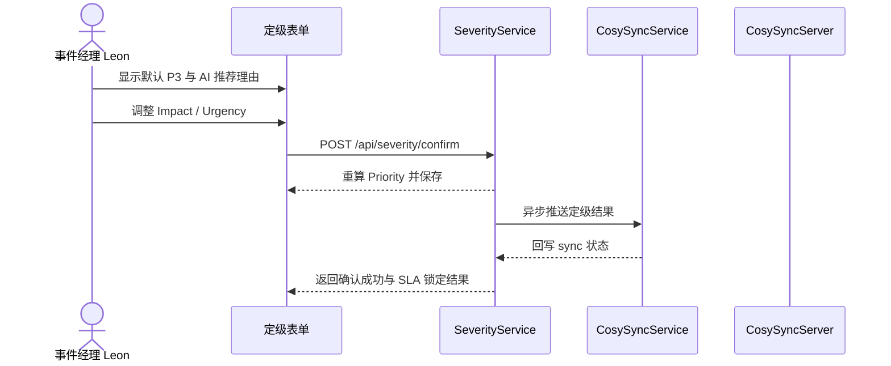

### 场景四：第三方外部 Cosy 系统自动推送对齐（跨阶段集成）

**业务流程：**

事件处理完毕后，后台 CosySyncService 数据驱动，它根据本地 Incidents 关系表中的 70+ 个精确属性，自动组装为高度保真的 JSON 对象。数据库该事件被第三方 Cosy 系统接收，Cosy 返回其自身的 Cosy Incident Number 后，系统会将其与本地 Incident Ticket 建立双向映射。前端页面静默刷新，并在同步状态卡中将状态从 pending 变更为 synced，同时显示本单的 Incident 和 Cosy 的单双号对仗。

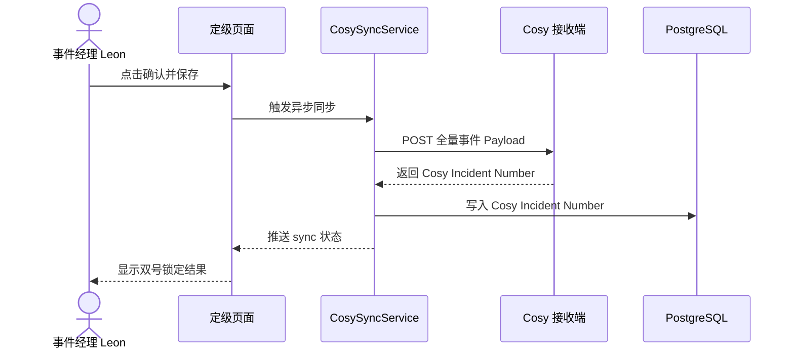

### 场景五：智能行动项提取、重复提交审阅与 Jira 同步监控（第 3 阶段 — Ongoing Handling & Tracking）

**业务流程：**

团队会议中，事件经理和 SRE 整理了排障记录，会议结束后，事件经理 Leon 粘贴进，点击"提取任务"。AI PM 迅速提炼出 3 个明确的任务，并在前端以"可编辑的交互式任务表单"呈现，作为草稿本供事件经理审阅。

若用户在该阶段未确认前重复提交动作的贴合文本，系统会基于最新文本重新生成任务推荐草稿，并在界面中展示本次推荐与上一草稿的差异，标注新增、更新、删除与待审查。

**人力资源接入 (Human-In-the-Loop)：** 事件经理 Leon 拥有完整控制权，他可以直接在表格中修改某项 AI 推荐的任务描述，重新指定负责人、调整截止时间、删除与本次事故无关的重复任务，或重新编辑并初始化新的自定义任务。

调整无误后，事件经理点击"确认并同步至 Jira"，系统一键将该任务持久化保存至本地 PostgreSQL 表中，并自动匹配关联对应的 SLA 截止时间。任务触发后，后台 SLA 预警系统监控立即执行。在截止前 14 分钟，任务还未点击"已完成"，定时器扫描触发自动发送预警到对应的 mAtters，并发出预警逻辑提醒，在详细页面任务面板上爆出黄色闪光警告。

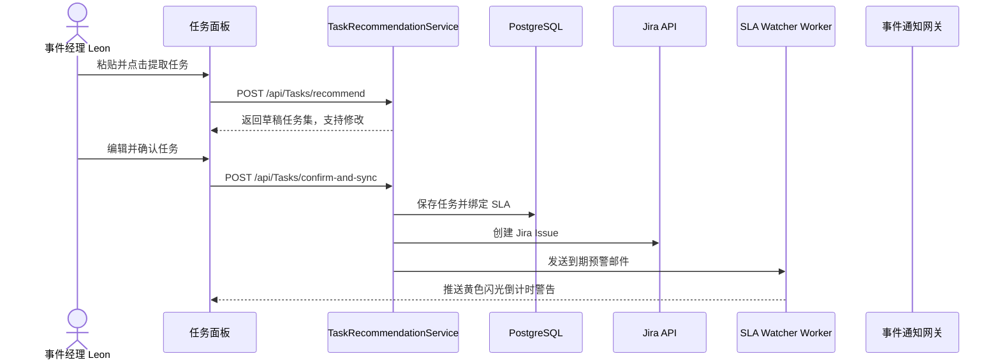

### 场景六：智能 RAG 行动步骤建议（第 3 阶段）

**业务流程：**

Pak Ming HUI 在排查相关白名单时遇到网络白名单语法问题，在问询框输入："GOD connect timeout after subnet routing changes"。系统在检索 pgvector 中进行余弦计算，召回 RAG 和历史复盘 chunks 联合检索，并优先展示用户最关心的 4 类信息：

1. **Impact scope：** 受灾情况、是否引起系统影响、以及影响数据。
2. **Support team / impact systems involved：** 当时涉及的支持团队、值班组与受影响系统清单。
3. **Root cause：** 上一次故障的根因是什么。
4. **Resolution time：** 上一次的故障修复时间。

界面将召回结果按"影响范围、支持团队/系统、根因、上次解决方式"四块卡片清晰列出，并注明出处，帮助工程师迅速判断能否直接复用历史方案。

### 场景七：一键智能复盘与归档闭环（第 4 阶段 — Post-Mortem & Closure）

**业务流程：**

排查管线测试全部通过，故障排除，事件经理 Leon 将事件状态变为 resolved。一键复盘按钮轻触，后台 AI 智能引擎以聚收集 Ticket 包含的 70+ 个属性、历史动态变更 timeline、以及 3 个 tasks 落地时间，自动生成一份极简专业 SRE 标准的 Markdown 复盘报告初稿。

页面加载后，事件经理在刷新界面点击"发布复盘"。自动生成标准的 SRE Notebook 复盘模板（严重程度、故障日期、Owner、故障总结、故障历史、Sequence of Events 时间线、故障回应、服务影响面、修复行动、复盘点与教训、复盘）。

后端自动进行 Confluence 目录树解析与挂载：系统自动读取故障发生时间并拆分为年月，按照 `Incidents/{年}/{月}/IN9451263` 的严苛级别树目录归类挂载。若该事件不存在时，则自动创建新挂载；最后将生成好的 Markdown 文件内容作为返回挂载符合对应归档的分页目录下的挂载。

同时调用 embedding API，将复盘生成现象、原因、对策 3 块 chunks 并向量化，写入 pgvector 数据库中，系统固化后知识检索召回结果，实现知识的同训自我进化。

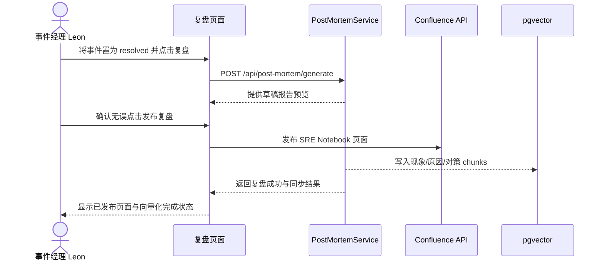

### 3.1 智能通报与管理模板（Templates Auto-filling Scenario）

**业务流程：**

在内部巡检警报的监测关键时，事件经理把一项标准的 "Incident Report" 通报模板（自动填充故障发生时间、摘要、Subject 主题行、业务受影响面、影响进度、及下一步升级告警），通过事件通知系统与 WebSocket 流进行一键正式通报，确保团队信息透明度。

**管理通报：** 事件解决并总结 (resolved) 时，事件经理一键调用标准的 "Management Report" 通报模板（自动填充事件标题，INC 单号、最新影响、恢复状态、根本原因、开单时间），直接导出用于向高层管理或 Jira 事件经理汇报，免去人工整理灾难文档的痛点。

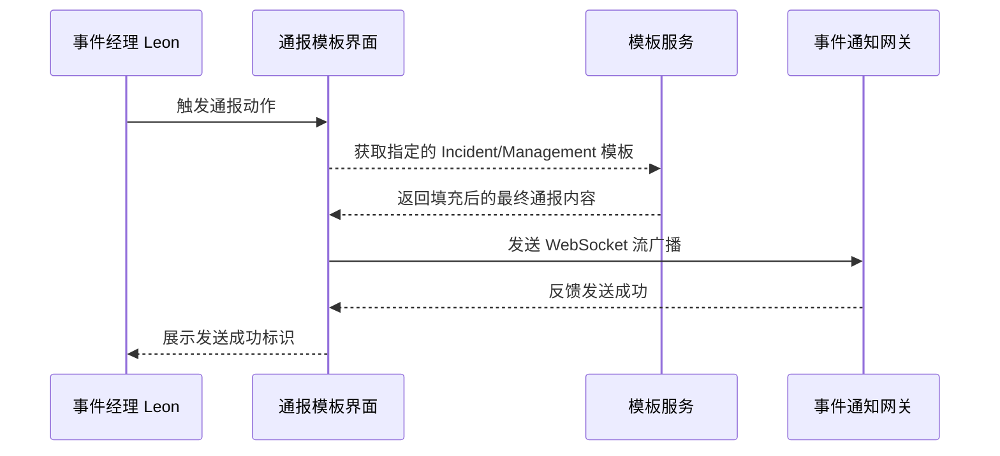

---

## 四、附录（Appendix: Reference Pages）

*(预留附录空间)*
