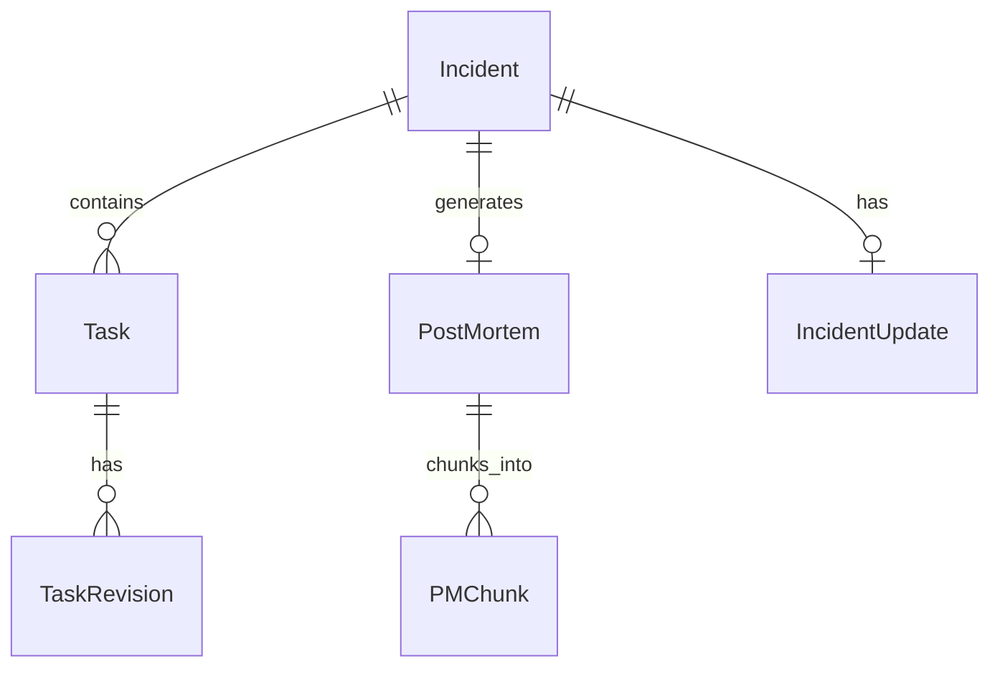

# AI 事件处置助手 — 用户需求规格说明书 (User Requirements Specification)

> **版本**: v1.0 | **日期**: 2026-07-23  
> **项目链接**: `ali-github.sysu.edu.cn/huoban/HASE-Cloud-Coc/IncidentManagement`

---

## 目录

1. [文档概述](#一文档概述)
2. [角色定义](#二角色定义)
3. [系统边界与外部集成](#三系统边界与外部集成)
4. [数据模型](#四数据模型)
5. [生命周期阶段 1 — 监控与发现](#五生命周期阶段-1--监控与发现)
6. [生命周期阶段 2 — 智能编排与定级](#六生命周期阶段-2--智能编排与定级)
7. [生命周期阶段 3 — 任务处理与跟踪](#七生命周期阶段-3--任务处理与跟踪)
8. [生命周期阶段 4 — 复盘与归档闭环](#八生命周期阶段-4--复盘与归档闭环)
9. [跨阶段功能 — 通报与模板](#九跨阶段功能--通报与模板)
10. [非功能性需求](#十非功能性需求)
11. [端到端场景故事 (IN9451263)](#十一端到端场景故事)
12. [验收标准](#十二验收标准)
13. [附录](#十三附录)

---

## 一、文档概述

### 1.1 目的

本文档定义 **AI 事件处置助手 (Incident Management System)** 的完整用户需求。系统通过 AI 辅助的事件编排、智能任务推荐、RAG 知识检索和自动化复盘，显著缩短平均故障恢复时间（MTTR），沉淀 SRE 运维知识。

### 1.2 范围

系统覆盖 Incident 完整的四大生命周期阶段：

| 阶段 | 名称 | 核心目标 |
|------|------|---------|
| 1 | 监控与发现 | 实时态势感知，快速定位当前 active 事件 |
| 2 | 智能编排与定级 | 非结构化文本 → 结构化事件 + AI 定级推荐 |
| 3 | 任务处理与跟踪 | AI 提取行动项 + SLA 监控 + RAG 推荐 |
| 4 | 复盘与归档闭环 | 一键生成复盘 → Confluence 发布 → pgvector 知识沉淀 |

### 1.3 术语定义

| 术语 | 英文 | 定义 |
|------|------|------|
| 事件 | Incident / Ticket | 系统内的一次故障记录，如 IN9451263 |
| 事件经理 | Incident Manager (IM) | 负责事件全生命周期管理，具备确认/覆写权限 |
| 处理工程师 | SRE Engineer | 一线响应人员，负责排障和技术执行 |
| 编排 | Orchestration | 将非结构化文本转化为结构化事件信息的 AI 过程 |
| 复盘 | Post-Mortem | 事件解决后的回顾分析报告 |
| 切片 | Chunk | 向量化知识的最小单元（现象/原因/对策） |

---

## 二、角色定义

### 2.1 事件经理 (Incident Manager)

| 属性 | 值 |
|------|-----|
| 系统标识 | `IM` |
| 示例人物 | Leon |
| 核心职责 | 事件全生命周期管理、定级确认、任务审核、复盘发布、信息通报 |
| 关联用例 | UC-01, UC-02, UC-03, UC-04, UC-07, UC-13 |

**权限矩阵**：

| 操作 | 权限 |
|------|------|
| 查看 Dashboard | ✓ |
| 触发事件编排 | ✓ |
| 确认/覆写 AI 定级 | ✓ (最终确认权) |
| 提取/编辑/确认 Task | ✓ (完整编辑权) |
| 发布 Report | ✓ |
| 发布复盘 | ✓ |
| 发送通报 | ✓ |

### 2.2 处理工程师 (SRE Engineer)

| 属性 | 值 |
|------|-----|
| 系统标识 | `SRE` |
| 示例人物 | Pak Ming HUI |
| 核心职责 | 告警响应、事件编排、RAG 检索排障、任务执行 |
| 关联用例 | UC-01, UC-02, UC-05, UC-06, UC-13 |

**权限矩阵**：

| 操作 | 权限 |
|------|------|
| 查看 Dashboard | ✓ |
| 触发事件编排 | ✓ |
| 查看 AI 定级 | ✓ (只读) |
| RAG 检索 | ✓ |
| 查看/执行 Task | ✓ |
| 更新事件描述 | ✓ |
| 确认定级 | ✗ (仅 IM) |
| 发布复盘 | ✗ (仅 IM) |

---

## 三、系统边界与外部集成

### 3.1 系统边界总览

```mermaid
flowchart TD
    subgraph System["AI 事件管理系统"]
        Dashboard["UC-01: 实时仪表盘"]
        Orchestrate["UC-02: 智能编排"]
        Severity["UC-03: 定级推导"]
        Task["UC-04: 任务提取"]
        Update["UC-05: 动态摘要"]
        RAG["UC-06: 步骤推荐"]
        PM["UC-07: 一键复盘"]
        Search["UC-13: 历史检索"]

        Embed["UC-08: Embedding"]
        Summary["UC-09: AI 摘要"]
        CosySync["UC-10: Cosy 同步"]
        ConfPublish["UC-11: Confluence 发布"]
        VecArchive["UC-12: 向量归档"]
    end

    IM["事件经理 Leon"] --> Dashboard
    IM --> Orchestrate
    IM --> Severity
    IM --> Task
    IM --> PM
    IM --> Search

    SRE["工程师 Pak Ming"] --> Dashboard
    SRE --> Orchestrate
    SRE --> Update
    SRE --> RAG
    SRE --> Search
```



### 3.2 外部系统集成

| 系统 | 用途 | 数据流向 | 触发时机 |
|------|------|---------|---------|
| **PostgreSQL** | 主数据库：Incidents (70+字段)、Tasks、SLA 记录 | 读写 | 全生命周期 |
| **pgvector** | 向量存储：runbook_steps, post_mortem_chunks | 读写 | 编排/检索/归档 |
| **mAtters** | 值班管理：拉取当前 on-call 人员，发送 SLA 预警 | 读 + 通知 | 编排 + SLA 守候 |
| **Cosy** | 第三方事件同步系统：双向映射 Incident ID | 异步推送 + 回写 | 创建 + 每次定级变更 |
| **Confluence** | 企业 Wiki：拉取 Runbook + 发布复盘报告 | 读 + 写入 | 编排 + 复盘 |
| **CMDB** | 配置库：获取服务绑定的 ITSO 安全负责人 | 只读 | 编排 |
| **Jira** | 任务同步：将确认后的 Task 创建为 Jira Issue | 写入 | Task 确认 |
| **WebSocket** | 实时通知：通报模板广播 | 推送 | 通报触发 |
| **SMTP** | 邮件通知：SLA 预警 | 发送 | SLA < 15min |

### 3.3 接口契约概要

| 接口 | 方法 | 路径 | 说明 |
|------|------|------|------|
| Incident 创建 | POST | `/api/incidents` | 创建事件，自动触发编排流程 |
| 事件编排 | POST | `/api/incidents/{id}/orchestrate` | 粘贴文本 → 三路并发 |
| 定级确认 | POST | `/api/incidents/{id}/severity/confirm` | Impact×Urgency → Priority |
| 任务提取 | POST | `/api/incidents/{id}/tasks/recommend` | 提取 Task 草稿 |
| 任务确认 | POST | `/api/incidents/{id}/tasks/confirm` | 保存 + 同步 Jira |
| RAG 检索 | POST | `/api/incidents/{id}/rag/search` | 输入 Query → Top-3 建议 |
| 复盘生成 | POST | `/api/incidents/{id}/postmortem/generate` | 生成 Markdown 草稿 |
| 复盘发布 | POST | `/api/incidents/{id}/postmortem/publish` | Confluence + pgvector |
| Cosy 同步 | POST | `/api/cosy/sync` | 推送事件到 Cosy |
| 通报发送 | POST | `/api/templates/send` | WebSocket 广播 |

---

## 四、数据模型

### 4.1 核心实体

#### Incident (事件) — 70+ 属性

| 分类 | 字段 | 类型 | 说明 |
|------|------|------|------|
| **标识** | `ticket_id` | VARCHAR(32) | 如 IN9451263 |
| **基本信息** | `title` | TEXT | 事件标题 |
| | `description` | TEXT | 当前描述（随进展更新） |
| | `status` | ENUM | active / investigating / mitigated / resolved |
| | `severity` | ENUM | P0 / P1 / P2 / P3（默认 P3） |
| | `impact` | ENUM | Critical / High / Medium / Low |
| | `urgency` | ENUM | Critical / High / Medium / Low |
| | `priority` | ENUM | 只读，Impact×Urgency 矩阵计算 |
| **服务** | `service_name` | VARCHAR | 受影响服务 |
| | `business_line` | VARCHAR | 受影响业务线 |
| | `affected_components` | TEXT[] | 受影响组件列表 |
| **时间** | `created_at` | TIMESTAMPTZ | 创建时间（本地时间） |
| | `resolved_at` | TIMESTAMPTZ | 解决时间 |
| | `duration` | INTERVAL | 持续时长 (自动计算) |
| **AI** | `ai_severity_reason` | TEXT | AI 定级推荐理由 |
| | `embedding_description` | VECTOR | 文本向量 |
| | `embedding_root_cause` | VECTOR | 根因向量 |
| **外部** | `cosy_incident_no` | VARCHAR | Cosy 事件编号 |
| | `cosy_sync_status` | ENUM | pending / synced / failed |
| | `cosy_synced_at` | TIMESTAMPTZ | Cosy 同步时间 |
| **其他** | `version` | INT | 更新版本号 |
| | `tags` | TEXT[] | 标签 |
| | `source` | VARCHAR | 事件来源 (manual/xmatter/monitoring) |

#### Task (任务)

| 字段 | 类型 | 说明 |
|------|------|------|
| `id` | UUID | 主键 |
| `incident_id` | FK | 关联事件 |
| `description` | TEXT | 任务描述 |
| `assignee` | VARCHAR | 负责人 |
| `deadline` | TIMESTAMPTZ | 截止时间 |
| `status` | ENUM | pending / in_progress / completed / rejected |
| `priority` | ENUM | high / medium / low |
| `source` | VARCHAR | AI 提取 / 人工创建 |
| `jira_issue_key` | VARCHAR | Jira Issue Key |
| `sla_warning_sent` | BOOLEAN | SLA 预警是否已发送 |
| `revision_history` | JSONB | 修订历史 |

#### Post-Mortem (复盘)

| 字段 | 类型 | 说明 |
|------|------|------|
| `id` | UUID | 主键 |
| `incident_id` | FK | 关联事件 |
| `content` | TEXT | Markdown 格式报告全文 |
| `severity` | ENUM | 最终严重级别 |
| `owner` | VARCHAR | 复盘负责人 |
| `symptom` | TEXT | 现象 (chunk 1) |
| `root_cause` | TEXT | 根因 (chunk 2) |
| `countermeasure` | TEXT | 对策 (chunk 3) |
| `confluence_url` | VARCHAR | Confluence 页面 URL |
| `embedding_symptom` | VECTOR | 现象向量 |
| `embedding_root_cause` | VECTOR | 根因向量 |
| `embedding_countermeasure` | VECTOR | 对策向量 |
| `published_at` | TIMESTAMPTZ | 发布时间 |

### 4.2 实体关系



---

## 五、生命周期阶段 1 — 监控与发现

### 5.1 UC-01：实时仪表盘监控看板

| 属性 | 值 |
|------|------|
| **编号** | UC-01 |
| **参与者** | 事件经理 (IM)、处理工程师 (SRE) |
| **前置条件** | 用户已认证登录，具备 Incident 读取权限 |
| **触发方式** | 用户进入系统首页自动加载 |

**主事件流**：

1. 系统查询 `status IN ('open', 'investigating', 'mitigated')` 的事件列表
2. 列表按 `created_at` 降序排列（本地时间）
3. 每条记录计算并显示已持续时间：`NOW() - created_at`
4. 事件按 Status 分列展示（Kanban 视图）
5. 每条卡片显示：Ticket ID、标题、严重级别、受影响服务、持续时间、负责人

**异常流**：

- 若无 Active 事件：显示空状态提示 "暂无进行中的事件"
- 若查询超时（> 3s）：降级显示最近 50 条记录（含 resolved）

**界面约束**：

- **严禁**显示任何形式的"截止时间倒计时"
- 持续时间仅显示已过去时间（如 "2h 15m"），不显示目标值
- 状态颜色编码：Open=红色, Investigating=琥珀色, Mitigated=蓝色, Resolved=绿色

**验收标准**：

- [ ] Dashboard 在 2s 内完成首屏渲染
- [ ] Active 事件按 created_at 降序正确排列
- [ ] 持续时间字段随页面停留实时更新（每 30s 刷新）
- [ ] 界面不包含任何倒计时元素

---

### 5.2 UC-13：历史故障多维筛选与模糊检索

| 属性 | 值 |
|------|------|
| **编号** | UC-13 |
| **参与者** | 事件经理 (IM)、处理工程师 (SRE) |
| **前置条件** | 用户处于 Dashboard 或检索页面 |

**主事件流**：

1. 用户在搜索栏输入 Ticket ID（如 `IN9451263`）或标题关键字
2. 可选：勾选 Severity（P0-P3）、受影响服务、业务线、时间范围筛选
3. 系统并行执行：
   - **关键词匹配**：PostgreSQL `ILIKE` 模糊搜索
   - **语义检索**：输入文本 → embedding → pgvector 余弦相似度 Top-20
4. 两路结果通过 RRF (Reciprocal Rank Fusion) 融合排序后展示

**异常流**：

- 输入为空：不触发检索
- 无匹配结果：显示 "未找到匹配的事件" + 建议调整关键词

**验收标准**：

- [ ] 输入 Ticket ID 精确匹配时，结果排在首位
- [ ] 关键词检索 + 向量检索并行执行
- [ ] RRF 融合结果与单路检索相比 Recall@10 提升 15%+

---

### 5.3 UC-14：受影响服务与业务线状态高亮

| 属性 | 值 |
|------|------|
| **编号** | UC-14 |
| **参与者** | 事件经理 (IM)、处理工程师 (SRE) |
| **触发方式** | Dashboard 自动标注 |

**主事件流**：

1. 系统统计每个 `service_name` + `business_line` 组合下 Active 事件数
2. 在 Dashboard 侧栏展示 Top-10 受影响服务
3. 受影响服务 > N 条事件时，状态高亮为红色

**验收标准**：

- [ ] 受影响服务列表随事件状态变更实时更新

---

## 六、生命周期阶段 2 — 智能编排与定级

### 6.1 UC-02：一键智能响应编排

| 属性 | 值 |
|------|------|
| **编号** | UC-02 |
| **参与者** | 处理工程师 (SRE)、事件经理 (IM) |
| **前置条件** | 已创建事件，编排文本框已打开 |
| **目标响应时间** | ≤ 4 秒（三路并发） |

**主事件流**：

1. 用户将告警信息、即时通讯记录等非结构化文本粘贴到编排文本框
2. 点击 "一键编排" 按钮
3. 系统触发三路并发处理（目标 ≤ 4s）：

   **路径 A — AI 两步式摘要 (UC-09)**：
   - Step 1：提取关键实体（时间、服务、错误码、影响范围）
   - Step 2：生成结构化 SRE 报告大纲（事实总结 + 置信度）

   **路径 B — 向量检索 (UC-08 → pgvector)**：
   - 文本 → embedding → 余弦相似度匹配 Top-3 历史事件
   - 每个匹配附带：历史事件标题、根因、解决方案、相似度分数

   **路径 C — 外部系统导航 (UC-15)**：
   - mAtters：拉取当前 on-call SRE 值班人员
   - Confluence：拉取相关服务的 SRE Runbook 链接
   - CMDB：获取 ITSO 安全负责人联系方式

4. 编排状态流转为 `pending`

**异常流**：

- 文本为空：提示 "请输入告警或通讯文本"
- 三路中任一路失败（> 5s 超时）：该路径降级显示 "暂时不可用"，不影响其他路径
- Cosy 推送失败：记录错误日志，状态保持 `pending`，不阻塞编排

**后置条件**：

- 事件的基础信息已保存
- 页面展示：结构化摘要卡片 + Top-3 相似事件 + 值班人/联系人信息
- Cosy 初始化推送已发起

**验收标准**：

- [ ] 三路并发完成时间 ≤ 4s (P95)
- [ ] Top-3 历史事件匹配至少 1 条相关
- [ ] 任一路失败不影响其他路径的展示
- [ ] on-call 人员信息与 mAtters 数据一致

---

### 6.2 UC-03：事件故障等级推导与人工修正

| 属性 | 值 |
|------|------|
| **编号** | UC-03 |
| **参与者** | 事件经理 (IM) |
| **前置条件** | 事件已创建，默认 P3 等级；AI 定级推荐已生成 |

**业务规则**：

| 规则 | 说明 |
|------|------|
| **默认等级** | 所有新创建的事件初始 Severity = P3 |
| **AI 推荐** | 系统根据描述文本 + 受影响服务推断推荐等级及理由 |
| **人工覆写** | IM 可通过 Impact / Urgency 下拉框手动调整 |
| **只读 Priority** | Impact × Urgency 映射表自动计算，不可手动修改 |
| **SLA 绑定** | 确认等级后自动绑定对应 SLA 时限 |

**Impact × Urgency → Priority 映射表**：

| Impact ↓ / Urgency → | Critical | High | Medium | Low |
|----------------------|----------|------|--------|-----|
| **Critical** | P0 | P0 | P1 | P2 |
| **High** | P0 | P1 | P2 | P3 |
| **Medium** | P1 | P2 | P3 | P3 |
| **Low** | P2 | P3 | P3 | P3 |

**主事件流**：

1. IM 查看：当前 Severity（默认 P3）+ AI 推荐等级 + 推荐理由
2. 如需升级/降级，IM 修改 Impact / Urgency 下拉框
3. 系统实时重算 Priority（只读显示）
4. IM 输入人工修正理由
5. 点击 "确认并保存" → 系统锁定等级 + 绑定 SLA
6. 触发 Cosy 异步同步

**异常流**：

- 未输入修正理由即点击确认：提示 "请填写定级修正理由"
- Cosy 同步失败：记录状态，不影响本地定级确认

**后置条件**：

- Severity、Impact、Urgency、Priority 已锁定
- SLA 计时器已启动
- Cosy 同步已发起

**验收标准**：

- [ ] Priority 严格按映射表计算，不可手动修改
- [ ] 未填写理由时无法确认
- [ ] 定级确认后 SLA 自动启动
- [ ] Cosy 同步状态在前端可见

---

## 七、生命周期阶段 3 — 任务处理与跟踪

### 7.1 UC-04：AI 推荐行动项提取

| 属性 | 值 |
|------|------|
| **编号** | UC-04 |
| **参与者** | 事件经理 (IM)、处理工程师 (SRE) |
| **前置条件** | 有非结构化处理描述文本（会议纪要、排障记录等） |

**主事件流**：

1. 用户将文本粘贴到任务提取区域，点击 "提取任务"
2. 系统调用 LLM，提取结构化 Task 草稿：
   - 任务描述（具体可执行）
   - 建议负责人（基于文本推断 + mAtters 值班信息）
   - 假定截止时间（基于 Severity SLA 推算）
3. Task 草稿以前端可编辑表格形式呈现，状态 = `draft`
4. 用户可执行以下操作：
   - **修改**：编辑任务描述、负责人、截止时间
   - **删除**：移除不相关的任务
   - **新增**：手动创建自定义任务
   - **重排序**：调整任务优先级

**重复提交处理**：

- 若用户修改文本后再次点击 "提取任务"：
  - 系统对比新推荐与上一草稿
  - 界面标注差异：<span style="color:green">+新增</span> / <span style="color:red">-删除</span> / <span style="color:orange">~修改</span> / 保留

**确认流程**：

5. 用户点击 "确认并同步至 Jira"
6. 系统：保存任务到 PostgreSQL → 绑定 SLA → 创建 Jira Issue → 启动 SLA 监控
7. 任务状态从 `draft` 变为 `confirmed`

**验收标准**：

- [ ] 提取的 Task 至少包含 description + assignee + deadline 三要素
- [ ] 重复提交时正确标注差异
- [ ] 确认后 Jira Issue 创建成功
- [ ] SLA 监控进程在任务确认后 1 分钟内启动

---

### 7.2 UC-16：Task SLA 预警

| 属性 | 值 |
|------|------|
| **编号** | UC-16 |
| **触发机制** | 后台 cron job，每分钟扫描一次 |
| **预警阈值** | 距 deadline < 15 分钟 |

**主事件流**：

1. SLA Watcher Worker 每分钟执行：
   ```sql
   SELECT * FROM tasks 
   WHERE status != 'completed' 
   AND deadline - NOW() < INTERVAL '15 minutes'
   AND sla_warning_sent = FALSE
   ```
2. 触发预警的任务：
   - 前端任务面板该任务背景闪烁黄色
   - mAtters 发送通知给任务负责人
   - SMTP 发送预警邮件
   - `sla_warning_sent` 标记为 TRUE

**验收标准**：

- [ ] 预警在 deadline 前 15 分钟准确触发
- [ ] 黄色闪烁持续至任务被标记完成
- [ ] 不会对同一任务重复发送预警

---

### 7.3 UC-06：RAG 下一步行动步骤推荐

| 属性 | 值 |
|------|------|
| **编号** | UC-06 |
| **参与者** | 处理工程师 (SRE) |
| **前置条件** | 工程师输入了排障 Query |

**主事件流**：

1. 工程师在检索框输入技术问题（如 "GOD connect timeout after subnet routing changes"）
2. 系统调用 UC-08 → embedding → pgvector 余弦检索
3. 检索范围：`runbook_steps` + `post_mortem_chunks`
4. 返回 Top-3 结果，以四块卡片展示：

| 卡片 | 内容 | 数据来源 |
|------|------|---------|
| 影响范围 (Impact Scope) | 受灾情况、影响系统及数据 | post_mortem_chunks.symptom |
| 支持团队/系统 (Support Team) | 当时涉及的值班组与受影响系统 | post_mortem_chunks.symptom |
| 根因 (Root Cause) | 上一次故障的根因分析 | post_mortem_chunks.root_cause |
| 解决方式 (Resolution) | 上次修复耗时 + 解决方案摘要 | post_mortem_chunks.countermeasure |

5. 每块卡片标明出处（Incident ID），点击可跳转查看详情

**验收标准**：

- [ ] Top-3 结果在 2s 内返回
- [ ] 每张卡片含出处链接
- [ ] Recall@3 在已知故障集上 ≥ 60%

---

## 八、生命周期阶段 4 — 复盘与归档闭环

### 8.1 UC-07：一键 SRE 复盘与知识沉淀

| 属性 | 值 |
|------|------|
| **编号** | UC-07 |
| **参与者** | 事件经理 (IM) |
| **前置条件** | 事件状态 = `resolved`，一键复盘按钮解锁 |

**主事件流**：

**Phase A — 生成草稿**：

1. IM 点击 "一键复盘"
2. LLM 聚合数据源：
   - Incident 70+ 属性
   - 所有 Task 列表及执行状态
   - 动态 Timeline 事件流
   - 更新历史（version history）
3. 生成 Markdown 格式 SRE Notebook 报告草稿，包含：
   - 严重程度、故障日期、Owner
   - 故障总结
   - 故障历史 (Timeline of Events)
   - 故障回应 (Response Actions)
   - 服务影响面 (Impact Assessment)
   - 修复行动 (Remediation)
   - 复盘要点与教训 (Lessons Learned)

**Phase B — 审阅与发布**：

4. IM 审阅草稿，可直接编辑 Markdown 内容
5. 点击 "发布复盘" → 触发两路操作：

   **路径 A — Confluence 发布 (UC-11)**：
   - 自动解析故障时间 → 提取年月 → 构建目录路径 `Incidents/{year}/{month}/IN9451263`
   - 若目录不存在，自动创建
   - 将 Markdown 渲染为 XHTML，挂载到对应目录
   - 返回 Confluence 页面 URL

   **路径 B — pgvector 归档 (UC-12)**：
   - 从报告提取三要素：现象 (Symptom)、原因 (Root Cause)、对策 (Countermeasure)
   - 每个 chunk 调用 UC-08 生成 embedding 向量
   - 写入 `post_mortem_chunks` 表

**后置条件**：

- Confluence 页面可访问
- 三要素向量已入库
- 未来 RAG 检索可召回本次复盘的知识
- 系统完成知识的自演进闭环

**异常流**：

- Confluence 发布失败：提示手动发布，不阻塞向量归档
- 向量生成失败：记录日志，允许后续重试

**验收标准**：

- [ ] 草稿生成 ≤ 10s
- [ ] SRE Notebook 模板 11 个 Section 完整
- [ ] Confluence 目录自动创建
- [ ] 三要素 chunk 成功写入 pgvector
- [ ] 后续 RAG 检索可召回本次复盘内容

---

## 九、跨阶段功能 — 通报与模板

### 9.1 通报模板系统

**两类模板**：

| 模板类型 | 使用场景 | 自动填充字段 |
|---------|---------|------------|
| **Incident Report** | 事件处理中，团队信息同步 | 故障发生时间、摘要、Subject、业务受影响面、影响进度、下一步升级告警 |
| **Management Report** | 事件 resolved 后，向管理层汇报 | 事件标题、INC 单号、最新影响、恢复状态、根本原因、开单时间 |

**发送方式**：

- 通过 WebSocket 流广播到前端
- 可选：SMTP 邮件发送给指定收件人列表

**验收标准**：

- [ ] Incident Report 模板字段自动填充正确
- [ ] Management Report 模板字段自动填充正确
- [ ] WebSocket 广播在 1s 内送达所有连接的客户端

---

## 十、非功能性需求

### 10.1 性能

| 指标 | 目标值 |
|------|--------|
| Dashboard 首屏渲染 | ≤ 2s |
| 事件编排三路并发 | ≤ 4s (P95) |
| 向量检索 Top-3 | ≤ 2s |
| 复盘草稿生成 | ≤ 10s |
| API 响应 (P95) | ≤ 3s |
| 并发用户 | 50+ |

### 10.2 可用性

| 指标 | 目标值 |
|------|--------|
| 系统可用率 | 99.9% |
| 数据持久性 | PostgreSQL WAL + pgvector 备份 |
| 降级策略 | AI 服务不可用时，编排手动完成；RAG 不可用时，仅关键词检索 |

### 10.3 安全

| 要求 | 说明 |
|------|------|
| 认证 | 企业 SSO / LDAP 集成 |
| 权限控制 | IM 与 SRE 角色分离（见 §2） |
| 数据加密 | 传输层 TLS，存储层 AES-256 |
| 审计日志 | 所有 CUD 操作记录到 audit_log 表 |

### 10.4 扩展性

| 要求 | 说明 |
|------|------|
| 数据库 | PostgreSQL 支持读写分离；pgvector 支持 IVFFlat 索引 |
| AI 服务 | LLM 调用支持 OpenAI / Azure / 本地模型可切换 |
| 知识库 | post_mortem_chunks 支持定期重新索引 |

### 10.5 界面约束

| 规则 | 来源 |
|------|------|
| 严禁显示事件故障截止时间倒计时 | UC-01 |
| 持续时间仅显示已过去时间，不显示目标值 | UC-01 |
| 状态颜色编码全局一致 | 全局 UI 规范 |

---

## 十一、端到端场景故事 (IN9451263)

> 以 Jenkins Master 8 断流生产事件 (IN9451263) 为例，演示完整用户旅程。

### 场景 1：仪表盘态势感知 — Leon 登录

```
Leon 登录系统 → Dashboard 展示 3 条 Active 事件
  → IN9451263 显示 P2 级别、持续 45min、受影响服务 Jenkins-UK
  → 界面干净无倒计时，聚焦当前状态
  → Leon 点击进入详情页
```

### 场景 2：智能编排 — Pak Ming 粘贴告警文本

```
Pak Ming HUI 接警 → 打开 IN9451263 编排页
  → 粘贴 Jenkins 告警 + Slack 讨论记录（非结构化）
  → 点击 "一键编排"
  → 4 秒内三路返回：
     [摘要] Jenkins Master 8 迁移中，IP 被安全组隔离
     [相似] 历史防火墙策略过期事件 (相似度 82%)
     [联系人] on-call: Pak Ming HUI | ITSO: Anish Rajkumar
  → 编排完成，页面更新
```

### 场景 3：定级确认 — Leon 升级等级

```
Leon 查看 AI 推荐：P2（基于 Impact=High, Urgency=Medium）
  → 评估后认为实际影响更大
  → 修改 Urgency: Medium → High
  → 系统重算 Priority: P2 → P1
  → Leon 输入理由："跨团队影响，需紧急协调安全组变更"
  → 点击确认 → SLA 启动，Cosy 同步
```

### 场景 4：Cosy 自动对齐

```
定级确认后 → CosySyncService 自动推送事件到 Cosy
  → Cosy 返回 Incident Number: COSY-8842
  → 系统建立双向映射 IN9451263 ↔ COSY-8842
  → 前端同步状态：pending → synced
  → 页面显示双号对仗
```

### 场景 5：任务提取与 Jira 同步

```
团队会议后，Leon 粘贴会议纪要 → 点击 "提取任务"
  → AI 提取 3 个 Task：
     1. 联系安全组添加白名单 (assign: Pak Ming, 2h)
     2. 验证 Jenkins 连接恢复 (assign: Pak Ming, 1h)
     3. 更新 Runbook 文档 (assign: Leon, 4h)
  → Leon 审阅：调整 Task 1 截止时间为 1h，删除 Task 3（已有 Jira）
  → 点击 "确认并同步至 Jira"
  → 2 个 Task 写入 DB + 创建 Jira Issue + SLA 启动
```

### 场景 6：RAG 智能推荐

```
Pak Ming 排查白名单问题时遇到语法错误
  → 输入 Query："GOD connect timeout after subnet routing changes"
  → RAG 返回 4 块卡片：
     [影响] 上次类似事件影响了 3 个 Jenkins 节点，30+ job 中断
     [团队] 值班组 Network-SRE + 安全组 ITSO
     [根因] 安全组规则过期，未在路由变更时同步更新
     [方案] 手动添加白名单 → 恢复 → 自动化工单流程改进
  → Pak Ming 直接参考历史方案执行
```

### 场景 7：一键复盘与知识沉淀

```
故障排除，Leon 将事件状态改为 resolved
  → "一键复盘" 按钮解锁
  → Leon 点击 → 系统聚合所有数据 → 10s 生成 Markdown 报告
  → Leon 审阅，修改 Lessons Learned 部分
  → 点击 "发布复盘"
  → Confluence 自动创建 Incidents/2025/07/IN9451263 页面
  → 现象/原因/对策三要素向量化写入 pgvector
  → 系统完成知识闭环
```

---

## 十二、验收标准

### 12.1 功能验收清单

| 编号 | 功能 | 验收条件 |
|------|------|---------|
| F-01 | Dashboard 看板 | Active 事件正确展示，无倒计时元素 |
| F-02 | 事件创建 | 支持手动创建 + xMatter Webhook 自动创建 |
| F-03 | 智能编排 | 粘贴文本 → 三路并发 → 卡片展示 |
| F-04 | AI 定级 | Impact×Urgency → Priority，支持人工覆写 |
| F-05 | Task 提取 | 文本 → 可编辑 Task 草稿 → 确认同步 |
| F-06 | Task SLA | 15 分钟内预警触发 |
| F-07 | RAG 检索 | Query → 4 块卡片 → Top-3 |
| F-08 | 复盘生成 | Resolved → 一键生成 + 发布 |
| F-09 | Confluence | 自动创建目录 + 挂载页面 |
| F-10 | pgvector 归档 | 三要素向量写入 + RAG 可召回 |
| F-11 | Cosy 同步 | 创建+定级变更 → 双向映射 |
| F-12 | 通报模板 | 自动填充 + WebSocket 广播 |
| F-13 | 历史检索 | 关键词 + 向量融合检索 |

### 12.2 非功能验收清单

| 编号 | 指标 | 目标值 |
|------|------|--------|
| NF-01 | Dashboard 首屏 | ≤ 2s |
| NF-02 | 编排响应 (P95) | ≤ 4s |
| NF-03 | RAG 检索 | ≤ 2s |
| NF-04 | 复盘生成 | ≤ 10s |
| NF-05 | 并发用户 | 50+ |
| NF-06 | 系统可用率 | 99.9% |

---

## 十三、附录

### A. 用例编号映射

| UC 编号 | 名称 | 生命周阶段 |
|---------|------|----------|
| UC-01 | 实时仪表盘监控看板 | Phase 1 |
| UC-02 | 一键智能响应编排 | Phase 2 |
| UC-03 | 事件故障等级推导与人工修正 | Phase 2 |
| UC-04 | AI 推荐行动项提取与 Task SLA 分配 | Phase 3 |
| UC-05 | 动态报告摘要合并更新 | Phase 3 |
| UC-06 | RAG 下一步行动步骤推荐 | Phase 3 |
| UC-07 | 一键 SRE 复盘与知识沉淀 | Phase 4 |
| UC-08 | 文本向量 embedding 生成 | Cross-cutting |
| UC-09 | AI 报告两步式结构化摘要 | Phase 2 |
| UC-10 | 第三方 Cosy 系统异步数据对齐 | Phase 2 |
| UC-11 | Confluence AI 日报自动发布 | Phase 4 |
| UC-12 | SRE 三要素切片 pgvector 归档 | Phase 4 |
| UC-13 | 历史故障多维筛选与模糊检索 | Phase 1 |
| UC-14 | 受影响服务与业务线状态高亮 | Phase 1 |
| UC-15 | mAtters & Confluence 异步活动引擎 | Phase 2 |
| UC-16 | Task SLA 15分钟临期部件与面板报警 | Phase 3 |

### B. 状态流转

```
Incident:
  open → investigating → mitigated → resolved

Task:
  pending → in_progress → completed
  pending → rejected
  in_progress → rejected

Report:
  draft → published → archived

Cosy Sync:
  pending → synced → failed (retryable)
```

### C. 文档修订历史

| 版本 | 日期 | 作者 | 变更 |
|------|------|------|------|
| v1.0 | 2026-07-23 | — | 初始版本，完整用户需求规格 |
